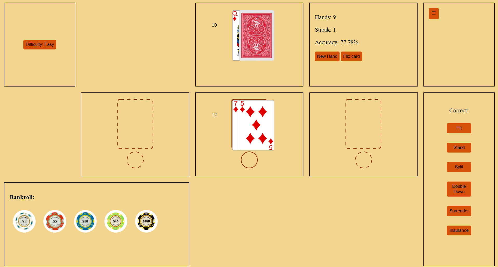
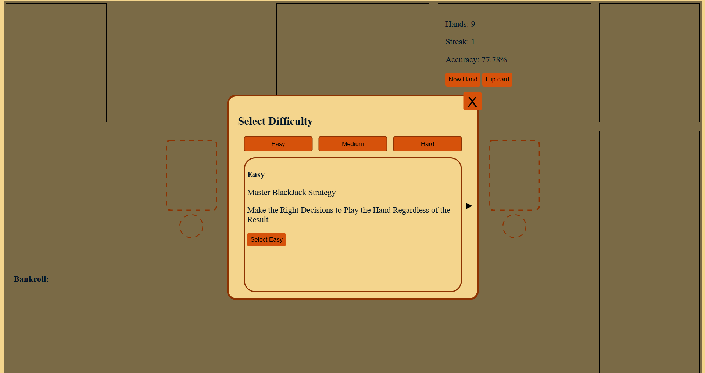

# BlackjackMastery

Blackjack Mastery is an interactive web application designed to help players learn and practice optimal blackjack strategy. The site provides a virtual blackjack table where users can play hands, track performance statistics, and improve decision-making skills through progressive difficulty levels.

Players can log in, create an account, or play as a guest to start practicing. The game interface simulates a real blackjack table with dealer and player hands, betting chips, and common blackjack decisions such as hit, stand, split, double down, surrender, and insurance.

Features
* Interactive blackjack table interface
* Multiple difficulty levels that unlock as players improve
* Decision-based gameplay for practicing optimal strategy
* Performance tracking including hands played, streaks, and accuracy
* Guest mode and user signup/login
* Menu with stats, achievements, leaderboard, and settings

Tech Stack
* HTML
* CSS
* JavaScript (ES modules)
Purpose

This project is designed as a training tool to help players master blackjack strategy, card counting concepts, and advanced decision-making through structured gameplay and increasing levels of difficulty.
